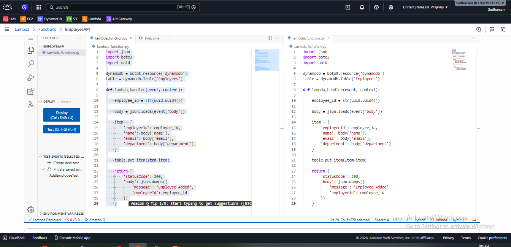
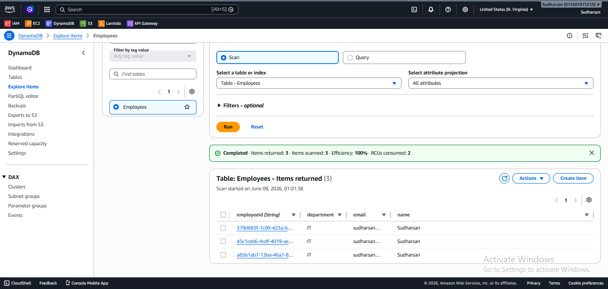
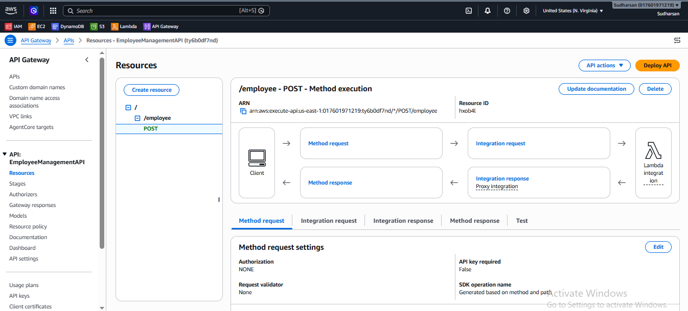
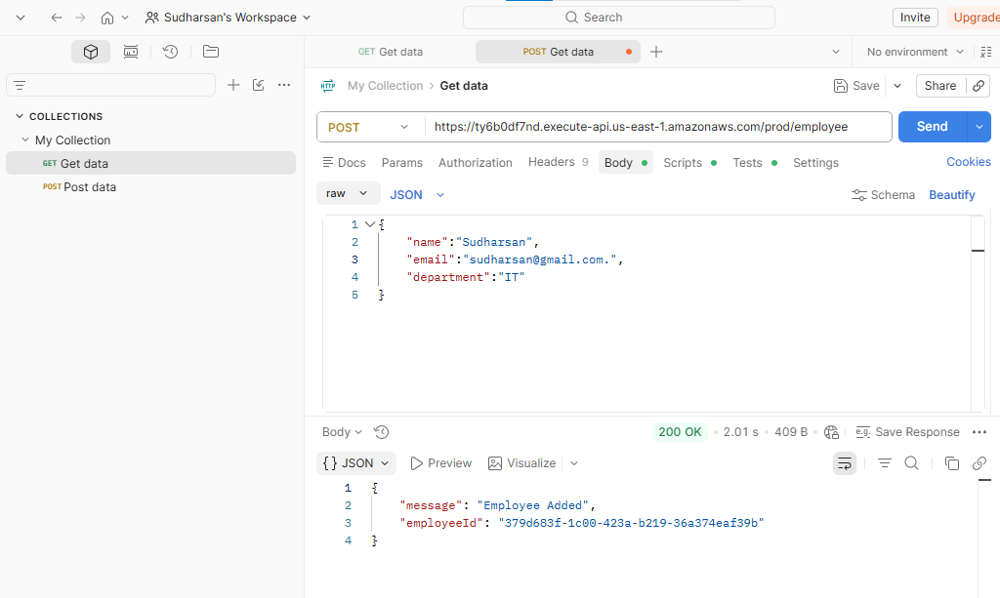

# AWS Serverless Employee Management System

## Overview

A serverless employee management application built using AWS services.

## Architecture

API Gateway → Lambda → DynamoDB

## AWS Services Used

- AWS Lambda
- Amazon API Gateway
- Amazon DynamoDB
- AWS IAM
- Amazon CloudWatch

## Features

- Add Employee
- Generate Unique Employee ID
- Store Employee Data in DynamoDB
- REST API Endpoint
- Serverless Architecture

## API Endpoint

POST /employee

### Sample Request

```json
{
  "name": "Sudharsan",
  "email": "sudharsan@gmail.com",
  "department": "IT"
}
```

### Sample Response

```json
{
  "message": "Employee Added",
  "employeeId": "379d683f-1c00-423a-b219-36a374eaf39b"
}
```

## Screenshots

### Lambda Function Success


### DynamoDB Table


### API Gateway


### Postman Test


## Author

Sudharsan K
